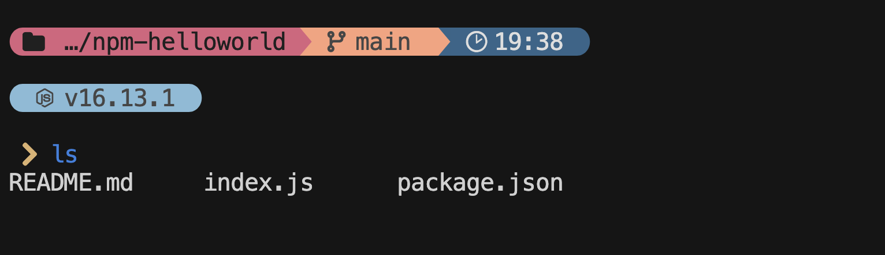

# color-liner
This is a preset for Starship that offers a prompt preset with vibrant colors.  

# Showcase
  

# Features
1. Displays the current directory.
2. Shows the active git branch name and its status.
3. Displays the current time.
4. Shows versions of tools like Node.js and Python, among others.

# Getting Started
## Prerequisite
1. Install [starship](https://starship.rs/)
2. Install [Nerd Fonts](https://www.nerdfonts.com/#home)   

## Installation
1. Copy the 'starship.toml' file to the `~/.config/` directory in your home folder.

## Configuration
You can further customize the behavior and appearance of the color-liner preset by editing the 'starship.toml' configuration file. Modify prompts, colors, and more according to your preferences.

## Acknowledgment
I'm inspired by the preset of [Pastel Powerline Preset](https://starship.rs/presets/pastel-powerline.html). It's one of the coolest presets I've ever seen!

## Conclusion
I'm confident that the vibrant and informative prompts will enhance your terminal experience. Enjoy a better terminal life!
